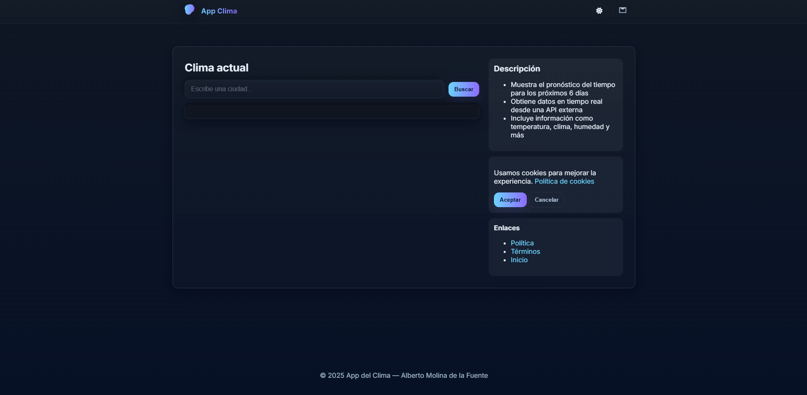
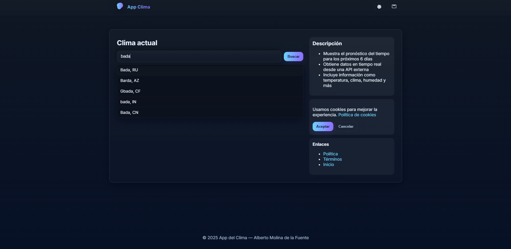
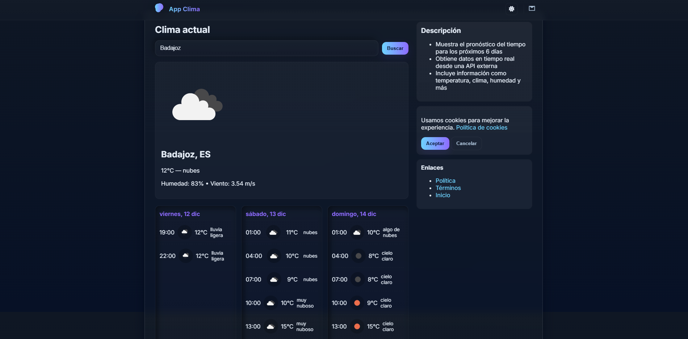
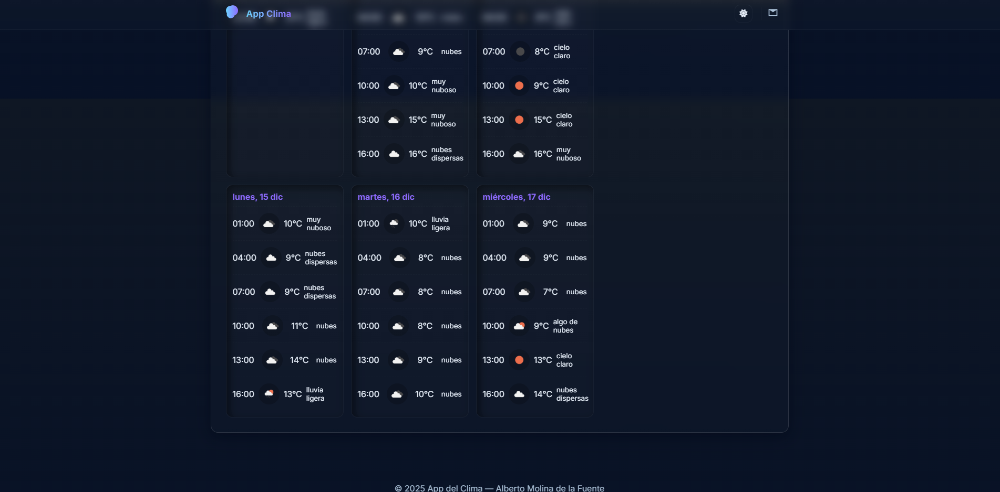

.

🌦️ App del Clima

Aplicación del clima desarrollada en HTML, CSS, JavaScript y Node.js (Express), con una interfaz moderna basada en Glassmorphism.
Consulta el clima actual y el pronóstico extendido utilizando una API backend que protege la API key.

✨ Características principales

🔍 Búsqueda inteligente de ciudades

- Autocompletado con sugerencias.
- Resultados rápidos y limpios.
- Validación de errores.

🌤 Clima actual

- Temperatura, humedad, viento, sensación térmica y descripción del clima.
- Iconos SVG personalizados compatibles con cualquier fondo.

📅 Pronóstico por días y por horas

- Vista detallada del clima futuro.
- Tarjetas con estilo neumórfico.

🧊 Diseño moderno Glassmorphism

- Paneles translúcidos con blur.
- Sombras suaves + bordes redondeados.
- Totalmente responsive.

🔒 API key protegida en backend

- La API del tiempo NO es llamada desde el frontend.
- El backend Express realiza todas las solicitudes a OpenWeather.
- El frontend solo se comunica con /api/weather y /api/forecast.

🍪 Banner de cookies

- Aceptar / rechazar.
- Accesible con roles ARIA.

📄 Páginas incluidas

- Política de privacidad
- Términos y condiciones
- Página principal

🖼️ Capturas de pantalla






🛠️ Tecnologías utilizadas

Frontend

- HTML5
- CSS3 (Glassmorphism + Neumorphism)
- JavaScript
- Fetch al backend propio
- SVG personalizados

Backend

- Node.js
- Express
- Dotenv
- Controladores y rutas REST
- CORS configurado
- Proxy seguro hacia OpenWeather

📁 Estructura del proyecto

```
clima-app-main
├─ backend
│  ├─ .env
│  ├─ package-lock.json
│  ├─ package.json
│  └─ src
│     ├─ app.js
│     ├─ controllers
│     │  └─ weather.controller.js
│     ├─ routes
│     │  └─ weather.routes.js
│     └─ server.js
├─ frontend
│  ├─ img
│  │  ├─ captura-busqueda.png
│  │  ├─ captura-forecast1.png
│  │  ├─ captura-forecast2.png
│  │  ├─ captura-home.png
│  │  └─ favicon
│  │     └─ aplicacion-meteorologica (1).png
│  ├─ index.html
│  ├─ package-lock.json
│  ├─ package.json
│  ├─ politicaPrivacidad.html
│  ├─ script.js
│  ├─ src
│  │  └─ style.css
│  └─ terminosYCondiciones.html
└─ README.md

```

⚙️ Instalación y ejecución

1️⃣ Clonar el repositorio
git clone https://github.com/TU_USUARIO/app-clima.git
cd app-clima

2️⃣ Instalar dependencias del backend
cd backend
npm install

3️⃣ Configurar tu API key en .env
OPENWEATHER_API_KEY=TU_API_KEY
PORT=4000

4️⃣ Iniciar el servidor
npm start

5️⃣ Abrir el frontend

Solo abre:

frontend/index.html

El frontend hace peticiones a:

GET /api/weather
GET /api/forecast

🔐 ¿Cómo se protege la API key?

La API key nunca aparece en el código del navegador porque:

✔ Se guarda en .env
✔ Express hace las peticiones a OpenWeather
✔ El frontend solo recibe datos procesados

---

Ejemplo de controlador:

const axios = require("axios");

const getWeather = async (req, res) => {
const { city } = req.query;
const url = `https://api.openweathermap.org/data/2.5/weather?    q=${city}&appid=${process.env.OPENWEATHER_API_KEY}&units=metric&lang=es`;
const response = await axios.get(url);
res.json(response.data);
};

module.exports = { getWeather };

---

🎯 Objetivo del proyecto

Este proyecto forma parte de mi portafolio profesional.
Demuestra:

- Desarrollo full-stack (frontend + backend).
- Diseño UI moderno y limpio.
- Consumo de APIs externas de forma segura.
- Gestión completa del flujo de datos.
- Organización modular de un proyecto real.

📝 Mejoras futuras

- Añadir favoritos (ciudades guardadas).
- Geolocalización automática.
- Dashboard meteorológico avanzado.

👨‍💻 Autor

Alberto Molina de la Fuente
Desarrollador Web Frontend / Full-Stack
📧 AMFDeveloperP@hotmail.com

📄 Licencia

Proyecto bajo licencia MIT.
